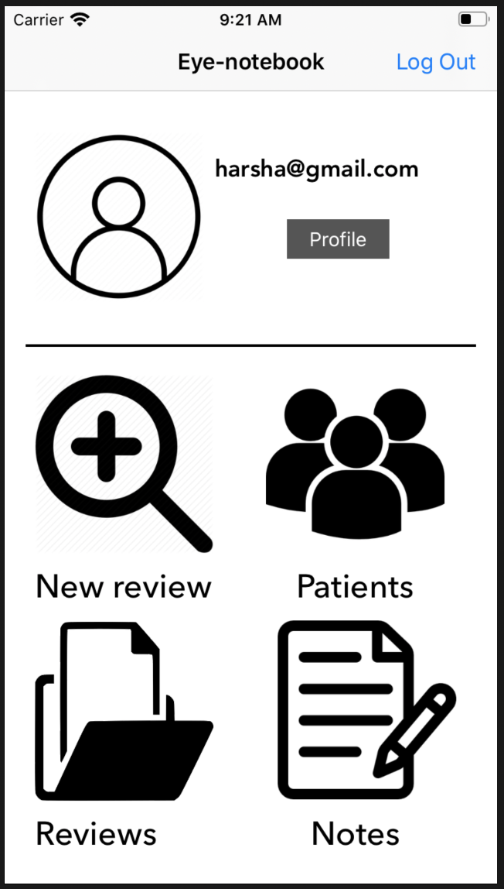

# Eye-Notebook0

Firebase Storing is implemented 
and retreiving of user profile data is been done 

# Application For Collection of Eye Specific Data
An Image Acquisition Apllication

# App Description
The Eyenotebook application allows users that to get an account of an individual such that to hold all the generic information
about the patients and their respective Eye image acquisitions those who are addressed to the corresponding Doctor.

# Snapshots of Screen Boards

 

# Working 
open project and traverse to the corresponding directory and install all the pods from the pod file

workspace is created, then run the project 
